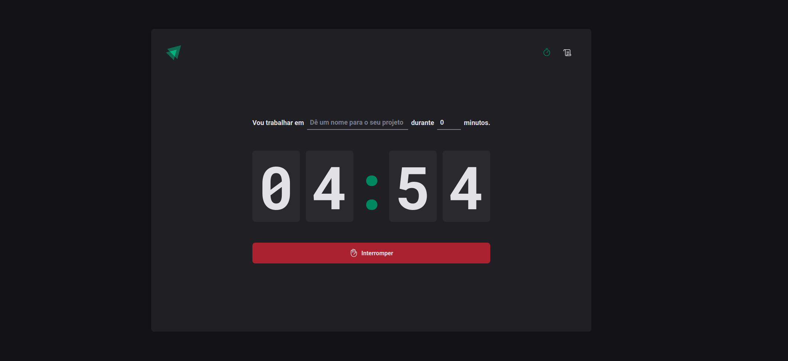

## Timer

Timer is a pomodoro projet, using Vite + React + Context API + Styled-Components + React Hook Form + React Router + Immer + date+fns 

## Layout


## Installation

Use a package manager of your choice (npm, yarn, etc.) in order to install all dependencies

```bash
yarn
```

## Usage

Just run `dev` script.

```bash
yarn dev
```

## Contact

Any question, bug and comment, you can mail me in gabrielhenrique.ls96@gmail.com or use Issues tab here in GitHub

Thank you.